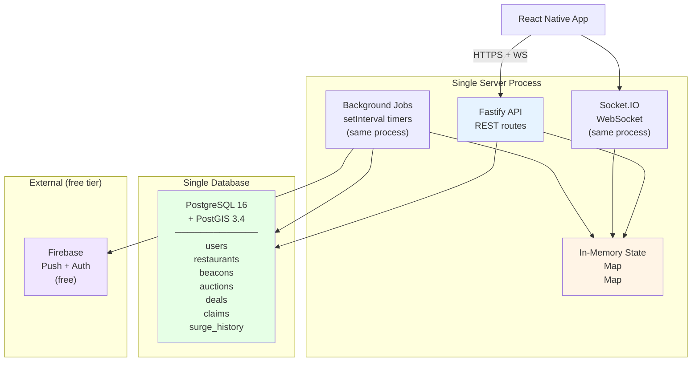

# Kohedha — Revised Implementation Plan (Single Backend)

## Architecture: Before vs After

| Aspect | ❌ Previous | ✅ Revised |
|---|---|---|
| Server | Fastify + separate worker | **Single Fastify process** (API + WebSocket + jobs) |
| Primary DB | PostgreSQL + PostGIS | **PostgreSQL + PostGIS** (same) |
| Cache | Redis (beacon TTL, noise, pub/sub) | **In-memory Maps** (backed by Postgres) |
| Time-series | TimescaleDB | **Regular Postgres table** with timestamp index |
| Job queue | BullMQ (Redis-backed) | **setInterval + setTimeout** (in-process) |
| Deploy | AWS ECS + RDS + ElastiCache + ALB | **Railway** (single service) or **$6 VPS** |
| Containers | 3 (API + API + Worker) | **1** |
| Cost | ~$58/month | **~$7/month** |

---

## Simplified Architecture



**One process. One database. That's it.**

---

## What Replaced Redis

| Redis was used for | Now handled by | Trade-off |
|---|---|---|
| Beacon TTL expiry | `setTimeout()` per beacon + `expires_at` column in Postgres | Fine up to ~1,000 concurrent beacons |
| Noise level (η_c) per user | `Map<string, NoiseState>` in memory + `noise_level` column in users table | Reloads from DB on server restart |
| Event pub/sub between modules | `EventEmitter` (already in the plan) | Same process = no network needed |
| Auction bid leaderboard | Sorted array in memory, persisted to `bids` table | Simpler than sorted sets |
| Rate limiting | In-memory counter with `Map<string, number>` | Resets on restart (acceptable for MVP) |

> [!NOTE]
> **When to add Redis back:** If you hit 1,000+ concurrent active beacons or need multiple server instances behind a load balancer. That's a good problem to have — it means the app is working.

---

## Revised File Structure

```
koheda-api/
├── src/
│   ├── app.ts                        ← single entry point
│   ├── config.ts                     ← env vars, constants
│   ├── db.ts                         ← single pg Pool connection
│   │
│   ├── modules/
│   │   ├── beacon/
│   │   │   ├── beacon.manager.ts     ← lifecycle + TTL timers
│   │   │   ├── beacon.spatial.ts     ← ψ calculation (PostGIS)
│   │   │   ├── beacon.vibe.ts        ← J Jaccard filter
│   │   │   ├── beacon.noise.ts       ← η_c state machine
│   │   │   └── beacon.types.ts       ← interfaces
│   │   │
│   │   ├── auction/
│   │   │   ├── auction.engine.ts     ← μ + σ + η_j + winner
│   │   │   └── auction.types.ts
│   │   │
│   │   └── deal/
│   │       ├── deal.service.ts       ← create, claim, redeem
│   │       └── deal.types.ts
│   │
│   ├── routes/
│   │   ├── health.routes.ts
│   │   ├── beacon.routes.ts
│   │   ├── restaurant.routes.ts
│   │   ├── auction.routes.ts
│   │   └── deal.routes.ts
│   │
│   └── ws/
│       └── socket.ts                 ← Socket.IO setup (same server)
│
├── migrations/
│   ├── 001_initial.sql
│   └── 002_seed_data.sql
│
├── package.json
├── tsconfig.json
├── Dockerfile
├── docker-compose.yml                ← just Postgres
└── .env
```

**15 files total.** No Redis config, no TimescaleDB config, no worker process, no job queue setup.

---

## Simplified Docker Compose (Local Dev)

```yaml
# docker-compose.yml — just one service
version: "3.9"

services:
  postgres:
    image: postgis/postgis:16-3.4
    container_name: koheda-db
    ports:
      - "5432:5432"
    environment:
      POSTGRES_DB: koheda
      POSTGRES_USER: koheda
      POSTGRES_PASSWORD: koheda123
    volumes:
      - pg_data:/var/lib/postgresql/data

volumes:
  pg_data:
```

```bash
# Start everything
docker-compose up -d    # just Postgres
pnpm dev                # your server

# That's it. Two commands.
```

---

## Simplified Database (Everything in One Postgres)

Surge pricing history, beacon state, noise levels — all in regular tables instead of separate services.

```sql
-- Surge history (was TimescaleDB, now just a regular table with index)
CREATE TABLE auction_history (
  id          UUID PRIMARY KEY DEFAULT gen_random_uuid(),
  vibe_tag    TEXT NOT NULL,
  winner_id   UUID REFERENCES restaurants(id),
  bid_amount  DECIMAL(10,2),
  created_at  TIMESTAMPTZ DEFAULT NOW()
);
CREATE INDEX idx_auction_history_time ON auction_history(created_at DESC);
CREATE INDEX idx_auction_history_tag  ON auction_history(vibe_tag, created_at DESC);

-- Noise tracking (was Redis, now a column on users)
ALTER TABLE users ADD COLUMN noise_level    FLOAT DEFAULT 0;
ALTER TABLE users ADD COLUMN noise_state    TEXT DEFAULT 'active';
ALTER TABLE users ADD COLUMN noise_updated  TIMESTAMPTZ DEFAULT NOW();

-- Beacon TTL (was Redis EXPIRE, now a column)
-- beacons table already has expires_at — just query WHERE expires_at > NOW()
```

> [!TIP]
> **Surge query without TimescaleDB:**
> ```sql
> SELECT vibe_tag, COUNT(*) as wins
> FROM auction_history
> WHERE created_at >= NOW() - INTERVAL '30 days'
> GROUP BY vibe_tag;
> ```
> With the index on `(vibe_tag, created_at)`, this runs in <5ms even with 100K rows.

---

## Revised Implementation Phases

### Phase 1 · Setup (Day 1)
> Server + database + health check running

```bash
docker-compose up -d
pnpm dev
curl http://localhost:3000/health
# → { "status": "ok", "postgres": "connected" }
```

---

### Phase 2 · Database + Seed (Day 2)
> 15 restaurants + 12 vibe tags queryable

```bash
pnpm run migrate
curl http://localhost:3000/api/restaurants?lat=6.9147&lng=79.8536&radiusKm=5
# → 8 restaurants sorted by distance
```

---

### Phase 3 · Beacon Lifecycle (Day 3–4)
> Activate, cancel, auto-expire, 1-per-user guard

```bash
curl -X POST http://localhost:3000/api/beacon/activate \
  -d '{ "userId": "u1", "lat": 6.9147, "lng": 79.8536, "vibeTags": ["rooftop","cocktails"] }'
# → { "beaconId": "b-xxx", "status": "active", "remaining": "2H 00M" }
```

Key change: TTL is a `setTimeout()` in the server process + `expires_at` column in Postgres.

```typescript
// beacon.manager.ts — simplified, no Redis
export class BeaconManager {
  private timers = new Map<string, NodeJS.Timeout>();

  async activate(userId: string, lat: number, lng: number, vibeTags: string[]) {
    // Check for existing active beacon
    const existing = await db.query(
      `SELECT id FROM beacons WHERE user_id = $1 AND status = 'active' AND expires_at > NOW()`,
      [userId]
    );
    if (existing.rows.length > 0) throw new Error('Already have active beacon');

    // Insert into Postgres
    const expiresAt = new Date(Date.now() + 7_200_000); // 2h
    const result = await db.query(
      `INSERT INTO beacons (user_id, location, vibe_tags, status, expires_at)
       VALUES ($1, ST_Point($3, $2)::geography, $4, 'active', $5)
       RETURNING id`,
      [userId, lat, lng, JSON.stringify(vibeTags), expiresAt]
    );

    const beaconId = result.rows[0].id;

    // In-memory timer for auto-expiry
    this.timers.set(beaconId, setTimeout(() => this.expire(beaconId), 7_200_000));

    this.eventBus.emit('beacon:activated', { beaconId, userId, lat, lng, vibeTags });
    return { beaconId, expiresAt };
  }
}
```

---

### Phase 4 · Spatial + Vibe Shield (Day 5–6)
> ψ signal strength + Jaccard filtering in a single endpoint

```bash
curl http://localhost:3000/api/beacon/b-xxx/matches
# → { passed: [...], shielded: [...], summary: { total: 6, passed: 4, shielded: 2 } }
```

Key change: Spatial query uses PostGIS directly — no Redis cache.

```typescript
// beacon.spatial.ts — single PostGIS query replaces SpatialEngine + cache
async function findMatchingRestaurants(beaconId: string) {
  return db.query(`
    SELECT
      r.id,
      r.name,
      ST_Distance(r.location, b.location) / 1000 AS distance_km,
      r.vibe_tags AS restaurant_tags,
      b.vibe_tags AS consumer_tags
    FROM restaurants r, beacons b
    WHERE b.id = $1
      AND b.status = 'active'
      AND ST_DWithin(r.location, b.location, 18000)  -- max radius 18km
    ORDER BY distance_km
  `, [beaconId]);
}
```

The ψ and J calculations happen in application code on the query results — no need for a separate service.

---

### Phase 5 · Noise Tracker (Day 7)
> State machine with in-memory state + Postgres persistence

```bash
curl http://localhost:3000/api/consumer/u1/state
# → { "state": "active", "noiseLevel": 0.45, "canReceive": false }
```

Key change: `Map<string, NoiseState>` in memory, synced to Postgres on every update.

```typescript
// beacon.noise.ts — in-memory with DB sync
const noiseCache = new Map<string, { level: number; updatedAt: number }>();

async function updateNoise(userId: string, matchCount: number) {
  let state = noiseCache.get(userId) ?? { level: 0, updatedAt: Date.now() };

  // Apply decay
  const hours = (Date.now() - state.updatedAt) / 3_600_000;
  state.level = state.level * Math.exp(-0.08 * hours) + 0.15 * matchCount;
  state.updatedAt = Date.now();

  noiseCache.set(userId, state);

  // Persist to Postgres (async, non-blocking)
  db.query(
    `UPDATE users SET noise_level = $1, noise_state = $2, noise_updated = NOW() WHERE id = $3`,
    [state.level, state.level >= 1.0 ? 'muted' : 'active', userId]
  );
}
```

---

### Phase 6 · Auction Engine (Day 8–10)
> Pond density + surge + efficiency scoring + winner selection

```bash
curl -X POST http://localhost:3000/api/auction/run -d '{ "beaconId": "b-xxx" }'
# → { "winner": "The Hangover Bar", "efficiencyScore": 762.4, ... }
```

All three sub-formulas (μ, σ, η_j) in a single file, running synchronously. No job queue.

---

### Phase 7 · Real-Time + Mobile (Day 11–15)
> Socket.IO on the same server, Expo app connected

```typescript
// app.ts — Socket.IO on the same Fastify server
import Fastify from 'fastify';
import { Server } from 'socket.io';

const app = Fastify();
const io = new Server(app.server);

// WebSocket and HTTP on the same port, same process
app.listen({ port: 3000 });
```

---

## Revised Deployment — Railway (3 Commands)

```bash
# 1. Install CLI + login
npm i -g @railway/cli && railway login

# 2. Create project with Postgres
railway init
railway add --plugin postgresql

# 3. Deploy
railway up
# → https://koheda-api.up.railway.app
```

**That's the entire deployment.** Railway auto-detects the Dockerfile, provisions PostgreSQL with PostGIS, and gives you a URL.

### Cost

| Service | Spec | Monthly |
|---|---|---|
| Railway (Starter) | 512 MB RAM, shared CPU | $5 |
| Railway PostgreSQL | 1 GB storage | $2 |
| Firebase Auth + FCM | Free tier | $0 |
| **Total** | | **~$7/month** |

Scale to Railway Pro ($20/month) when you need more RAM or a custom domain.

---

## When to Upgrade

This single-server architecture handles your needs until:

| Trigger | Sign | Add |
|---|---|---|
| > 500 concurrent beacons | `setTimeout` map grows large | Redis for TTL |
| > 100 WebSocket connections | Memory pressure on one process | Redis Pub/Sub for Socket.IO |
| Need 99.9% uptime | Can't afford restart downtime | Second instance + load balancer |
| > 1M auction_history rows | Surge query slows down | TimescaleDB or table partitioning |

> [!IMPORTANT]
> **You won't hit any of these limits during MVP or even early traction.** The codebase is structured with the EventBus pattern, so adding Redis later is a swap, not a rewrite.

---

## Open Questions

> [!IMPORTANT]
> **1. Starting point:** Are we starting from scratch, or do you have existing code?

> [!IMPORTANT]
> **2. Auth for early phases:** Use Firebase Auth from day one, or hardcoded test users for Phases 1–6 and add auth when building the mobile app?
